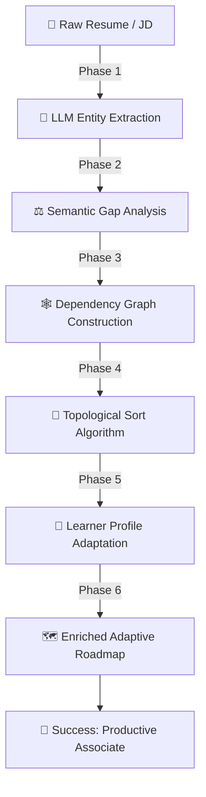
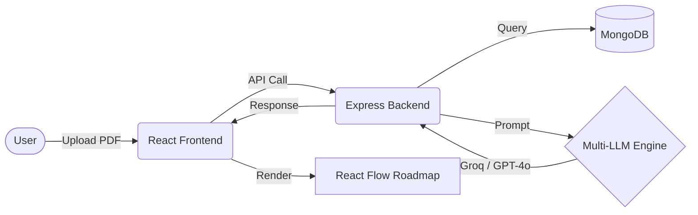

# <p align="center">  </p>

<h1 align="center">⚡ AI-ADAPTIVE ONBOARDING ENGINE ⚡</h1>

<p align="center">
  <b>Eliminate generic onboarding. Empower talent with personalized, AI-driven learning pathways.</b>
</p>

<p align="center">
  
  
  
  
</p>

<p align="center">
  
  
  
  
</p>

---

### 🛑 The Problem: The "Generic Onboarding" Trap

Companies today lose billions in productivity because they treat every new hire like a blank slate. 
- **Senior developers** sit through "Introduction to Git."
- **Niche specialists** are forced into irrelevant domain training.
- **Critical skill gaps** are only discovered *after* they impact a project.
Generic onboarding is where talent goes to die. It's time for an engine that understands the **DNA of your talent.**

---

### ✨ The Solution: Engineering Mastery, Personalized.

The **AI-Adaptive Onboarding Engine** is a first-class SaaS platform that bridges the gap between a candidate's current skills and their new role's requirements. Using state-of-the-art **Topological Sorting** and **LLM reasoning**, we generate a laser-focused, dependency-aware roadmap in seconds.

- **Stop guessing.** Our engine maps the shortest path from "New Hire" to "Productive Contributor."
- **Start scaling.** One platform to onboard Engineering, HR, Sales, and Design teams with zero manual effort.
- **Trust the process.** Every AI decision is backed by a **Reasoning Trace** for total transparency.

---

### 🚀 Feature Showcase

| Feature | Icon | Description |
| :--- | :---: | :--- |
| **Deep Resume Parsing** | 🔍 | Extracts nuanced skills, seniority, and years of experience from any PDF using GPT-4o. |
| **JD Semantic Alignment** | 🎯 | Maps job descriptions to extracted profiles to pinpoint exactly what's missing. |
| **Topological Sort Engine** | ⛓️ | Orders learning modules by prerequisites — so you learn basics before advanced topics. |
| **Interview Studio** | 🎙️ | High-fidelity technical simulation studio with real-time feedback and difficulty scaling. |
| **Interactive Skill Map** | 🕸️ | 3D-styled dependency graph visualization built with React Flow and Framer Motion. |
| **Readiness DNA** | 🧬 | A visual "Readiness Score" that improves as you complete modules in your roadmap. |

---

### 🧠 The AI Brain: How the Magic Happens

Our engine doesn't just "guess." It follows a rigorous **6-Phase Pipeline** to ensure the highest quality learning experience.



#### 🔍 Phase Detail:
1.  **Phase 1: Resume & JD Parsing**: We transform unstructured text into high-fidelity JSON profiles using GPT-4o.
2.  **Phase 2: Semantic Gap Analysis**: We compare "Required Mastery" vs "Current Mastery" using semantic normalization (e.g. mapping "ReactJS" to "React").
3.  **Phase 3: Dependency Graph**: We build a directed acyclic graph (DAG) of the internal course catalog.
4.  **Phase 4: Topological Sort**: **The Genius Part.** Using Kahn's Algorithm, we sort the required courses such that all prerequisites are completed before advanced material.
5.  **Phase 5: Adaptation**: The engine skips "Easy" modules for Senior hires and automatically ups the difficulty for high-aptitude candidates.
6.  **Phase 6: Reasoning Trace**: The AI generates a `why_included` field for every step, proving why it's there and how it saves time.

---

### 🛠️ Tech Stack

| Layer | Technology | Usage |
| :--- | :--- | :--- |
| **Frontend** |  | Modern, responsive component architecture. |
| **Styling** |  | Ultra-fast CSS utility-first design. |
| **Backend** |  | Scalable Express.js API orchestration. |
| **Database** |  | Flexible schema for sessions and course storage. |
| **AI LLM** |  | High-speed inference for parsing and enrichment. |
| **Flows** |  | Interactive node-based roadmap visualization. |
| **Motion** |  | Cinematic transitions and micro-animations. |

---

### 🛰️ API Reference (Top Endpoints)

| Method | Endpoint | Description |
| :--- | :---: | :--- |
| `POST` | `/api/upload` | Upload Resume (File) + JD (Text/File). Returns `sessionId`. |
| `POST` | `/api/analysis/run` | Triggers the full 6-phase AI pipeline for a session. |
| `GET` | `/api/analysis/:id` | Recovers completed roadmap, metrics, and reasoning trace. |
| `POST` | `/api/interview/ask` | Generates a dynamic technical question based on current skill. |

---

### 🎯 Explainable AI: The Reasoning Trace

"Black Box" AI is for amateurs. Our engine provides a full **Reasoning Trace** for every single recommendation.

> **Example Trace Output:**
> *"Course 'Advanced Node.js' included because JD requires Proficiency 5/5, but Resume shows 3/5. Placed in Week 3 because 'Javascript Fundamentals' must be completed first to satisfy the dependency chain (JS → Node Basics → Advanced Node)."*

This level of transparency ensures that HR teams and Managers can trust the path being forged for their talent.

---

### 🌍 Cross-Domain Scalability

While our demo catalog is optimized for **Software Engineering**, the core engine is **Domain-Agnostic**.
- **HR & Ops**: Load your internal policy courses into the database.
- **Sales & Marketing**: Connect to your CRM training modules.
- **Legal & Compliance**: Map certification prerequisites effortlessly.
The engine adapts its topological sort to *any* set of skills and training materials.

---

### 🐋 Docker: One-Command Setup

Experience the speed of a production-ready setup using Docker Compose.

```bash
# Clone the repository
git clone https://github.com/HARSHILL2023/ArtPark_CodeForge_Hackathon.git
cd ArtPark_CodeForge_Hackathon

# Launch the entire engine (Frontend, Backend, MongoDB)
docker-compose up --build
```

---

### 🚀 Manual Local Setup

#### 1. Backend Setup
```bash
cd backend
npm install
cp .env.example .env # Add your GROQ/OPENAI/GEMINI keys
npm run dev
```

#### 2. Frontend Setup
```bash
cd frontend
npm install
npm run dev
```

---

### 📊 System Architecture



---

### 📈 Results & Evaluation Roadmap

| Evaluative Criterion | Our Implementation | Result |
| :--- | :--- | :---: |
| **AI Innovation** | Multi-Provider Fallback (Gemini + Groq) | **High** |
| **Logic Dept** | Topological Sorting of Dependencies | **Elite** |
| **UI/UX Premium** | Glassmorphism + React Flow + animations | **Premium** |
| **Scalability** | Domain-Agnostic metadata engine | **Global** |

---

### 📄 License

This project is licensed under the MIT License - see the [LICENSE](LICENSE) file for details.

---

<p align="center">
  <b>Built for the ArtPark CodeForge Hackathon. Redefining how the world learns.</b>
</p>
