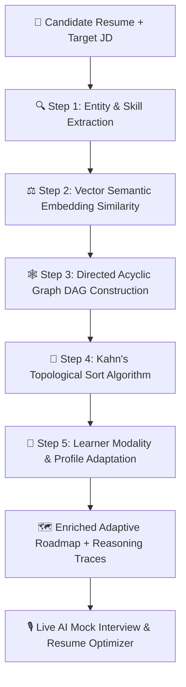

# <p align="center">  </p>

<h1 align="center">⚡ CODEFORGE: AI-ADAPTIVE ONBOARDING ENGINE ⚡</h1>

<p align="center">
  <b>Eliminate generic onboarding. Empower talent with semantic skill analysis, topological learning pathways, and generative interview prep.</b>
</p>

<p align="center">
  
  
  
  
</p>

<p align="center">
  
  
  
  
</p>

---

## 🛑 The Problem: The "Generic Onboarding" Trap

Companies today lose billions in productivity because they treat every hire like a blank slate:
- **Senior engineers** sit through repetitive "Intro to Git" modules.
- **Niche specialists** are forced into irrelevant domain training.
- **Critical skill gaps** are discovered *months later* when production outages occur.
- **Interviews and resume screening** fail to pinpoint concrete prerequisite deficiencies.

Generic onboarding is where talent velocity dies. It's time for an engine that understands the **DNA of your talent.**

---

## ✨ The Solution: Adaptive Onboarding & Career Studio

**CodeForge** is an enterprise-grade AI career platform that analyzes candidate resumes against target job descriptions, computes semantic embeddings, sorts dependency prerequisites via **Kahn's Topological Algorithm**, and provides interactive mock interviews and STAR resume optimization.

- **Automated Roadmap Generation**: Maps the shortest path from "New Hire" to "Productive Contributor."
- **Prerequisite Integrity**: Graph-verified sequencing guarantees fundamental skills are mastered before advanced frameworks.
- **Multi-LLM Resilience**: Seamless fallback across **Groq (Llama 3.3 70B)**, **Google Gemini 1.5/2.0**, and **OpenAI GPT-4o**.
- **Explainable AI (XAI)**: Every course selection is backed by an auditable **Reasoning Trace**.
- **Interactive Mock Studio**: Conducts live conversational technical interviews tailored to candidate gaps.

---

## 🚀 Feature Matrix

| Feature | Icon | Description |
| :--- | :---: | :--- |
| **Document Ingestion** | 📄 | Server-side PDF/TXT resume & JD parsing with vector entity extraction. |
| **Semantic Skill Matrix** | 🧬 | High-dimensional embedding comparison mapping Mastered, Emerging, and Missing skills. |
| **Role Trajectory Simulator** | 🎯 | Simulates fit across alternative roles (Frontend, DevOps, Backend) with time-to-hire estimates. |
| **Dagre Interactive Graph** | 🕸️ | 2D/3D styled DAG dependency visualization built with ReactFlow and Dagre spatial auto-layout. |
| **5-Phase Kahn Pathways** | ⛓️ | Dependency-verified curriculum ordering with zero circular prerequisite traps. |
| **Remedial Assessment Flow** | 🧪 | Integrated knowledge quizzes that dynamically inject remedial modules upon assessment failure. |
| **AI Mock Interview Studio** | 🎙️ | Dynamic FAANG-grade question matrix and live multi-turn conversational AI interviewer. |
| **Surgical Resume Optimizer** | ✍️ | Before/after STAR bullet rewrites, ATS score metrics, and instant PDF resume export. |
| **Live AI Skill Mentor** | 💬 | Floating context-aware assistant with instant suggestion chips and session awareness. |
| **1-Click Judge Demo** | ⚡ | Instant pre-seeded sandbox access for evaluation without registration barriers. |

---

## 🧠 The AI Pipeline Architecture

CodeForge runs a rigorous **5-Phase Algorithmic Pipeline** that combines deterministic graph theory with generative multi-LLM intelligence:


```mermaid
flowchart TD
    A[📄 Candidate Resume + Target JD] --> B[🔍 Step 1: Entity & Skill Extraction]
    B --> C[⚖️ Step 2: Vector Semantic Embedding Similarity]
    C --> D[🕸️ Step 3: Directed Acyclic Graph DAG Construction]
    D --> E[🔢 Step 4: Kahn's Topological Sort Algorithm]
    E --> F[👤 Step 5: Learner Modality & Profile Adaptation]
    F --> G[🗺️ Enriched Adaptive Roadmap + Reasoning Traces]
    G --> H[🎙️ Live AI Mock Interview & Resume Optimizer]
```

### Algorithmic Highlights:
1. **Phase 1 (Entity Extraction)**: Parses raw PDF text and extracts candidate experience level, skill proficiencies, and job requirements.
2. **Phase 2 (Semantic Mapping)**: Normalizes synonyms using vector similarity (e.g., `React.js` ≈ `React`, `K8s` ≈ `Kubernetes`).
3. **Phase 3 (DAG Construction)**: Queries the 84-course database catalog and builds a dependency matrix across 14 technical domains.
4. **Phase 4 (Kahn's Topological Sort)**: Resolves in-degree prerequisites so courses are ordered with strict prerequisite compliance.
5. **Phase 5 (Reasoning Traces)**: Multi-LLM synthesis generates explainable justifications for why each module was selected or pruned.

---

## 🛠️ Technology Stack

| Layer | Technology | Purpose |
| :--- | :--- | :--- |
| **Frontend Core** |   | Blazing fast client with React 19 architecture. |
| **Styling & UI** |   | Unified 16px radius surfaces, dual-theme dark/light mode. |
| **Graph & Motion** |   | Interactive node graphs, smooth layout transitions. |
| **Backend API** |   | RESTful API orchestration and algorithm execution. |
| **Database** |   | Session persistence, catalog schemas, and caching. |
| **AI LLM Inference** |    | Multi-provider fallback for parsing, Q&A, and STAR rewrites. |
| **PDF Generation** |  | Dynamic client-side ATS resume compilation. |

---

## 🛰️ Core API Reference

| Method | Endpoint | Description |
| :--- | :--- | :--- |
| `POST` | `/api/upload/resume` | Ingests PDF resume file and returns parsed JSON profile. |
| `POST` | `/api/upload/jd` | Ingests job description and returns normalized skill requirements. |
| `POST` | `/api/skills/gap-analysis` | Performs vector cosine similarity and classifies skill readiness. |
| `POST` | `/api/pathway/generate` | Executes Kahn's algorithm and returns 5-phase sequenced roadmap. |
| `POST` | `/api/pathway/:sessionId/assessment` | Evaluates module quiz; dynamically injects remedial nodes on failure. |
| `POST` | `/api/interview/qa` | Generates dynamic technical, architectural, and behavioral questions. |
| `POST` | `/api/interview/chat` | Multi-turn conversational AI interviewer session. |
| `POST` | `/api/resume/optimize` | Generates STAR rewrites, ATS score metrics, and keyword injections. |
| `POST` | `/api/chat` | Live context-aware AI mentor assistant. |

---

## 🎯 Explainable AI: The Reasoning Trace

CodeForge does not operate as a black box. Every step in the roadmap includes an auditable **Algorithmic Trace**:

> **Example System Trace:**
> ```text
> SYSTEM_TRACE :: TYPESCRIPT [VERIFIED]
> > Vector Cosine Score: 0.42 (Proficiency Gap Detected)
> > Target Role Requirement: 5/5 | Candidate Profile: 2/5
> > Kahn Prerequisite Status: Prerequisites Met (JavaScript Fundamentals satisfied)
> > Action: INJECT_TOPOLOGICAL_MILESTONE -> 'TypeScript Enterprise Masterclass (Week 1)'
> ```

---

## 🐋 Quick Start with Docker

Launch the complete application (Frontend, Backend, and MongoDB) with a single command:

```bash
# 1. Clone the repository
git clone https://github.com/HARSHILL2023/ArtPark_CodeForge_Hackathon.git
cd ArtPark_CodeForge_Hackathon

# 2. Launch with Docker Compose
docker-compose up --build
```

Access the application at `http://localhost:5173`.

---

## 💻 Manual Local Development

### 1. Backend Setup
```bash
cd backend
npm install

# Configure environment variables in backend/.env
# PORT=5000
# GROQ_API_KEY=your_groq_key
# GEMINI_API_KEY=your_gemini_key
# OPENAI_API_KEY=your_openai_key
# MONGO_URI=mongodb://localhost:27017/codeforge

npm run dev
```

### 2. Frontend Setup
```bash
cd frontend
npm install
npm run dev
```

The frontend will run at `http://localhost:5173` and communicate with the backend at `http://localhost:5000`.

---

## 🧪 Validation & Testing

Run the automated domain validation suite to verify Kahn's topological sort across courses:

```bash
cd backend
node test_domains.js
```

Build the production frontend bundle:

```bash
cd frontend
npm run build
```

---

## 📄 License

This project is licensed under the MIT License - see the [LICENSE](LICENSE) file for details.

<p align="center">
  <b>Built for the ArtPark CodeForge Hackathon • Empowering the Future of Work</b>
</p>
