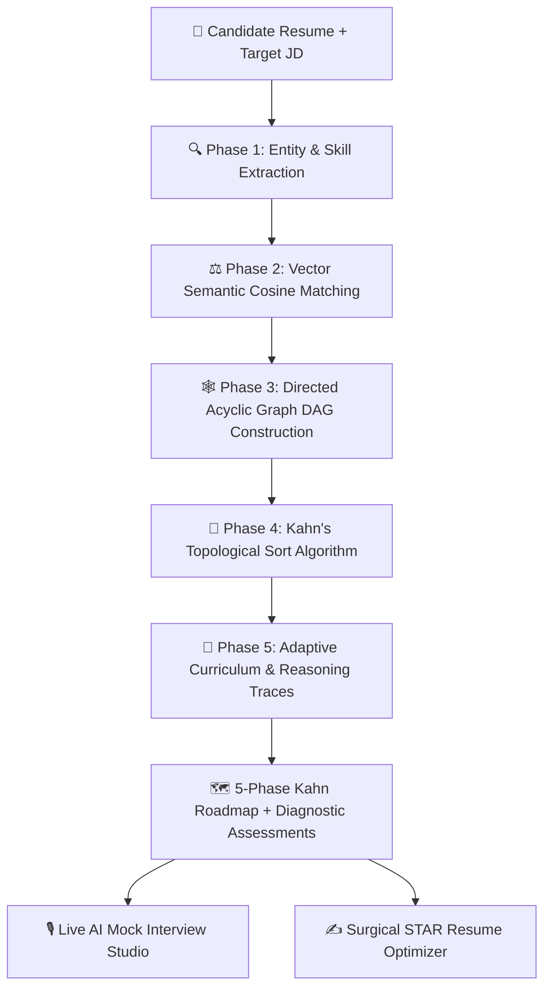

# <p align="center">  </p>

<h1 align="center">⚡ CODEFORGE: AI-ADAPTIVE ONBOARDING ENGINE ⚡</h1>

<p align="center">
  <b>Eliminate generic onboarding. Empower technical talent with semantic skill analysis, topological learning pathways, generative mock interviews, and ATS resume optimization.</b>
</p>

<p align="center">
  
  
  
  
  
</p>

<p align="center">
  
  
  
  
</p>

---

## 🛑 The Problem: The "Generic Onboarding" Trap

Engineering organizations lose billions in productivity because traditional onboarding treats every candidate and new hire like a blank slate:
- **Senior engineers** sit through repetitive basic modules.
- **Specialists** are forced into irrelevant, non-contextual training.
- **Critical prerequisite gaps** remain undetected until production incidents happen.
- **Interviews and ATS screening** fail to isolate concrete prerequisite blockers and give candidates no actionable remediation path.

Generic onboarding slows down talent velocity. **CodeForge** provides an engine calibrated specifically to the technical DNA of your talent.

---

## ✨ The Solution: Adaptive Career Intelligence Engine

**CodeForge** is an enterprise-grade AI career platform that analyzes candidate resumes against target job descriptions, computes semantic vector embeddings, sequences dependency prerequisites via **Kahn's Topological Sort Algorithm**, and provides interactive mock interviews and STAR resume optimization.

- **Unified Authentication Gateway**: Single entry point with Google OAuth, Email/Password, and 1-Click Judge Demo Sandbox Access.
- **Graph-Verified Learning Roadmaps**: 5-phase structured milestones guaranteed with zero circular dependency deadlocks.
- **Multi-LLM Fallback Architecture**: High-availability pipeline utilizing **Google Gemini 2.0/1.5** (Primary) → **OpenAI GPT-4o** (Secondary) → **Groq Llama 3.3 70B** (High-Speed Fallback).
- **Explainable AI (XAI)**: Every course recommendation or pruned module exposes an auditable **Algorithmic Trace** with vector similarity scores.
- **Interactive Mock Interview Studio**: Multi-turn conversational technical evaluations and curated FAANG-grade question matrices.
- **Surgical STAR Resume Optimizer**: Quantified before/after bullet rewrites, ATS match scores, and instant verifiable PDF export.

---

## 🎨 Design System & Visual Identity

CodeForge features a developer-first, editorial visual design system:

| Element | Specification | Tokens |
| :--- | :--- | :--- |
| **Typography** | Inter (Sans) + JetBrains Mono (Technical/Scores) | `var(--font-sans)`, `var(--font-mono)` |
| **Dark Theme** | Layered Graphite Surfaces with Warm Gold Accent | `#0C0D0F` (bg), `#121416` (card), `#181B1F` (hover), `#292D33` (border), `#D4A72C` (accent) |
| **Light Theme** | Warm Off-White Surfaces with Deep Amber Accent | `#F5F3EE` (bg), `#FCFBF8` (card), `#EEECE6` (sunken), `#DCD9D1` (border), `#B88916` (accent) |
| **Accenting Rule**| **90% Neutral / 10% Accent** | Accent color reserved exclusively for primary actions, active states, and focal metrics |
| **Semantic Tokens** | Matched (Green), Gap (Amber), Missing (Red) | Success (`#4CAF7A`/`#237A4B`), Warning (`#D6A84F`/`#9A6B00`), Danger (`#D96565`/`#B33A3A`) |

---

## 🚀 Feature Matrix

| Feature | Icon | Description |
| :--- | :---: | :--- |
| **Single Sign-In Gateway** | 🔐 | Unified entry point with Google Sign-In, Email auth, and isolated Judge Demo Sandbox sessions. |
| **Document Ingestion** | 📄 | Server-side PDF/TXT resume & JD parsing with vector entity extraction. |
| **Semantic Skill Matrix** | 🧬 | High-dimensional embedding comparison mapping Matched, Needs Work, and Missing skills. |
| **Role Trajectory Simulator** | 🎯 | Simulates fit across alternative roles (Frontend, DevOps, Backend) with time-to-hire estimates. |
| **Dagre Dependency Graph** | 🕸️ | Interactive DAG visualization built with ReactFlow and Dagre spatial auto-layout. |
| **5-Phase Kahn Pathways** | ⛓️ | Dependency-verified curriculum ordering with zero circular prerequisite traps. |
| **Remedial Assessment Flow** | 🧪 | Integrated knowledge quizzes that dynamically inject remedial modules upon assessment failure. |
| **AI Mock Interview Studio** | 🎙️ | Dynamic FAANG-grade question matrix and live multi-turn conversational AI interviewer. |
| **Surgical Resume Optimizer** | ✍️ | Before/after STAR bullet rewrites, ATS score metrics, and instant PDF resume export. |
| **Live AI Skill Mentor** | 💬 | Floating context-aware assistant with instant suggestion chips and session awareness. |

---

## 🧠 The AI Pipeline Architecture


```mermaid
flowchart TD
    A[📄 Candidate Resume + Target JD] --> B[🔍 Phase 1: Entity & Skill Extraction]
    B --> C[⚖️ Phase 2: Vector Semantic Cosine Matching]
    C --> D[🕸️ Phase 3: Directed Acyclic Graph DAG Construction]
    D --> E[🔢 Phase 4: Kahn's Topological Sort Algorithm]
    E --> F[👤 Phase 5: Adaptive Curriculum & Reasoning Traces]
    F --> G[🗺️ 5-Phase Kahn Roadmap + Diagnostic Assessments]
    G --> H[🎙️ Live AI Mock Interview Studio]
    G --> I[✍️ Surgical STAR Resume Optimizer]
```

### Algorithmic Highlights:
1. **Phase 1 (Entity Extraction)**: Parses raw PDF text and extracts candidate experience level, skill proficiencies, and job requirements.
2. **Phase 2 (Semantic Mapping)**: Normalizes technical terminology using vector similarity (e.g., `React.js` ≈ `React`, `K8s` ≈ `Kubernetes`).
3. **Phase 3 (DAG Construction)**: Queries the 84-course database catalog and builds a dependency matrix across 14 technical domains.
4. **Phase 4 (Kahn's Topological Sort)**: Resolves in-degree prerequisites so courses are ordered with strict prerequisite compliance.
5. **Phase 5 (Reasoning Traces)**: Multi-LLM synthesis generates explainable justifications with vector similarity scores for every selected or pruned module.

---

## 🛠️ Technology Stack

| Layer | Technology | Purpose |
| :--- | :--- | :--- |
| **Frontend Core** |   | Blazing fast client architecture with React 19. |
| **Styling & Design** |   | Standardized tokens, responsive layouts, dual light/dark modes. |
| **Typography** | Inter + JetBrains Mono | Google Fonts preconnect with clean editorial hierarchy. |
| **Graph & Motion** |   | Spatial DAG auto-layout with Dagre and smooth Framer transitions. |
| **Backend API** |   | RESTful API orchestration and algorithmic execution. |
| **Database** |   | Session persistence, catalog schemas, and caching. |
| **AI LLM Inference** |    | 3-tier fallback for extraction, Q&A, and STAR rewrites. |
| **PDF Generation** |  | Dynamic client-side ATS resume compilation. |

---

## 🛰️ Core API Reference

| Method | Endpoint | Description |
| :--- | :--- | :--- |
| `POST` | `/api/upload` | Ingests PDF/TXT resume and JD files for server-side entity extraction. |
| `POST` | `/api/analysis/run` | Performs vector cosine similarity and classifies skill gap delta. |
| `POST` | `/api/analysis/roadmap/generate` | Executes Kahn's algorithm and returns 5-phase sequenced roadmap. |
| `PATCH`| `/api/pathway/:sessionId/assessment` | Evaluates module quiz; dynamically injects remedial nodes on failure. |
| `POST` | `/api/interview/qa` | Generates dynamic technical, architectural, and behavioral questions. |
| `POST` | `/api/interview/chat` | Multi-turn conversational AI interviewer session. |
| `POST` | `/api/resume/optimize` | Generates STAR rewrites, ATS score metrics, and keyword injections. |
| `POST` | `/api/chat` | Live context-aware AI mentor assistant. |
| `GET`  | `/api/auth/me` | Fetches active authenticated or demo sandbox session. |

---

## 🎯 Explainable AI: The Reasoning Trace

CodeForge does not operate as a black box. Every step in the roadmap includes an auditable **Algorithmic Trace**:

> **Example System Trace:**
> ```text
> SYSTEM_TRACE :: TYPESCRIPT [VERIFIED]
> > Vector Cosine Score: 0.42 (Proficiency Gap Detected)
> > Target Role Requirement: 5/5 | Candidate Profile: 2/5
> > Kahn Prerequisite Status: Prerequisites Met (JavaScript Fundamentals satisfied)
> > Action: INJECT_TOPOLOGICAL_MILESTONE -> 'TypeScript Enterprise Architecture (Week 1)'
> ```

---

## 🐋 Quick Start with Docker

Launch the complete application (Frontend, Backend, and MongoDB) with a single command:

```bash
# 1. Clone the repository
git clone https://github.com/HARSHILL2023/ArtPark_CodeForge_Hackathon.git
cd ArtPark_CodeForge_Hackathon

# 2. Launch with Docker Compose
docker-compose up --build
```

Access the application at `http://localhost:5173`.

---

## 💻 Manual Local Development

### 1. Backend Setup
```bash
cd backend
npm install

# Configure environment variables in backend/.env:
# PORT=5000
# GROQ_API_KEY=your_groq_key
# GEMINI_API_KEY=your_gemini_key
# OPENAI_API_KEY=your_openai_key
# MONGO_URI=mongodb://localhost:27017/codeforge

npm run dev
```

### 2. Frontend Setup
```bash
cd frontend
npm install
npm run dev
```

The frontend will run at `http://localhost:5173` and communicate with the backend at `http://localhost:5000`.

---

## 🧪 Validation & Testing

Run the automated domain validation suite to verify Kahn's topological sort across courses:

```bash
cd backend
node test_domains.js
```

Build the production frontend bundle:

```bash
cd frontend
npm run build
```

---

## 📄 License

This project is licensed under the MIT License - see the [LICENSE](LICENSE) file for details.

<p align="center">
  <b>Built for the ArtPark CodeForge Hackathon • Empowering the Future of Work</b>
</p>
